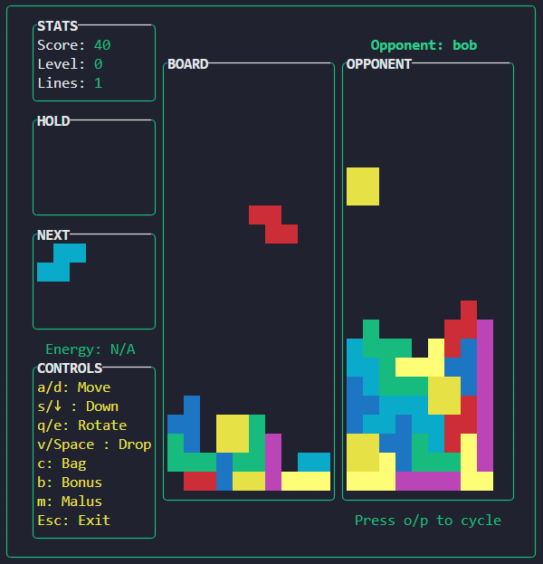
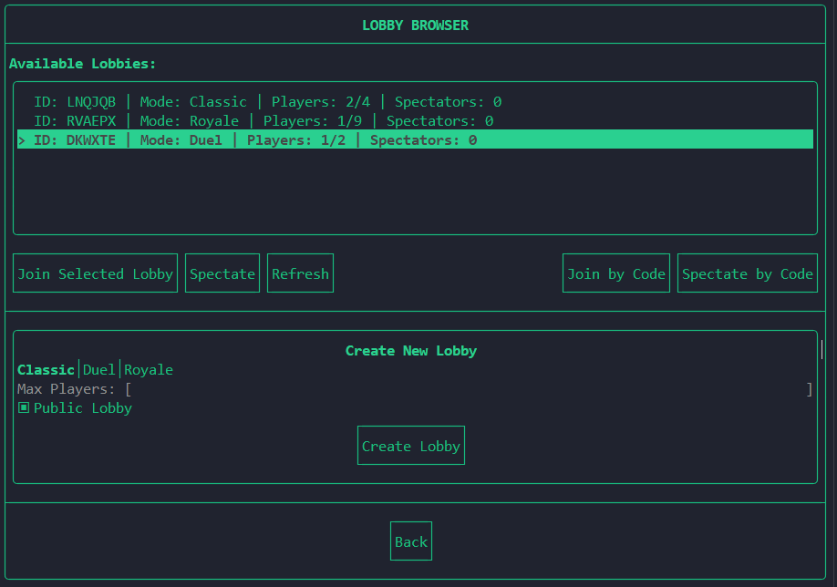

<!-- markdownlint-disable MD033 MD041 -->

<!-- pretty badges -->
<div align="center">
  
  
  
  
  
</div>

# 🎮 Tetris Royale

Welcome to **Tetris Royale**, a modern multiplayer version of the classic **Tetris** game. This project is developed using **C++** and **CMake**, and it incorporates a range of libraries such as **FTXUI**, **Boost**, **Qt5**, and others to provide an immersive and scalable gaming experience.

<div align="center">
  
  
  <p align="center"><em>In-game view and lobby browser</em></p>
</div>

## 🚀 Features

- **Battle Royale**: Play against up to 8 other players in real-time!
- **Modern C++**: Developed with modern C++ features, following an **Object-Oriented Programming (OOP)** approach.
- **Cross-Platform**: The project is designed to be cross-platform, allowing you to build and run it on various platforms (i.e. MacOS, Unix, Termux) using **CMake**.
- **Cross-Interface**: The client can be launched either in a terminal or with a graphical user interface (GUI) for a better experience.

## 💻 Installation

Ensure you have **CMake** and a **C++ compiler** installed on your system, as well as the `unzip` and `curl` packages.
**`Qt5`** also needs to be pre-installed. You can install it with your package manager, such as `apt` or `pacman`.
To get **Tetris Royale** up and running on your machine, you must use the `install.sh` installation script:

```sh
sh ./install.sh
```

This should install all the **dependencies**, launch the **CMake** and the **Makefile** to build the project. If this fails, you might want to use the **`Manual Installation Guide`** for this part.

## 🛠️ Manual Installation Guide

To install **Tetris Royale** on your machine, follow these steps:

### 1. Clone the Repository

Start by cloning the project repository to your local machine:

```sh
git clone https://github.com/solodeve/Tetris_Royal-ba2_year_project.git
cd ./Tetris_Royal-ba2_year_project
```

### 2. Install Dependencies

Ensure you have **CMake** and a **C++ compiler** installed on your system. You can use the provided script to automatically install the required dependencies:

```sh
sh ./scripts/find_dependencies.sh
```

This script will install any necessary libraries and tools for the project. You will then need to set up the **environment** to let the CMake know where your dependencies are:

```sh
sh ./lib/setup-env.sh
```

### 3. Build the Project

Create a build directory and configure the project using CMake. Then, compile the project using **make**:

```sh
mkdir build
cd build
cmake ..
make
```

This will generate the project files and compile the source code into executable binaries.

### 4. Run the Executable

After successfully building the project, you can run **Tetris Royale** as either the **server** or **client**:

- For **Server** (to host the game):

    ```sh
    sh ./bin/TetrisRoyaleMasterServer
    ```

- For **Client** (to connect to the server and play):

    ```sh
    sh ./bin/TetrisRoyaleClientTUI  # Terminal version
    sh ./bin/TetrisRoyaleClientGUI  # GUI version
    ```

## 📄 License

This project is licensed under the **MIT License**. See the [LICENSE](LICENSE) file for more details.

## 🧪 Tests

To ensure the project works as expected, you can run the unit tests included in the repository. Follow these steps to enable and execute the tests:

### 1. Enable Tests During Installation

When running the `install.sh` script, include the `--enable-tests` flag to enable the tests:

```sh
sh ./install.sh --enable-tests
```

This will configure the project to include the test suite during the build process.

### 2. Run the Tests

After the build is complete, navigate to the `build` directory and run the tests using `ctest`:

```sh
cd build
ctest --output-on-failure
```

This will execute all the tests and display detailed output for any failures.

### 3. Manual Test Configuration (Optional)

If you prefer to configure the tests manually, you can enable them directly with CMake:

```sh
mkdir build
cd build
cmake -DTETRIS_ENABLE_TESTS=ON ..
make
ctest --output-on-failure
```

This approach gives you more control over the build process.

## 🙏 Acknowledgements

This project was developed for the **`Projet d'informatique 2`** course **`INFO-F209`**. Special thanks to `Alexis Reynouard (ULB)`, `Simon Renard (ULB)` and `Hugo Callebaut (ULB)` for their guidance and support.

## 👥 Team Members

- Project done by an 8-person team
